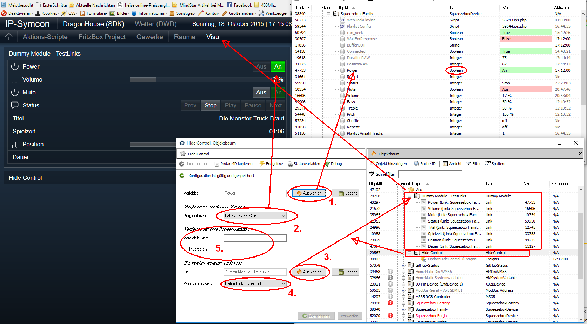
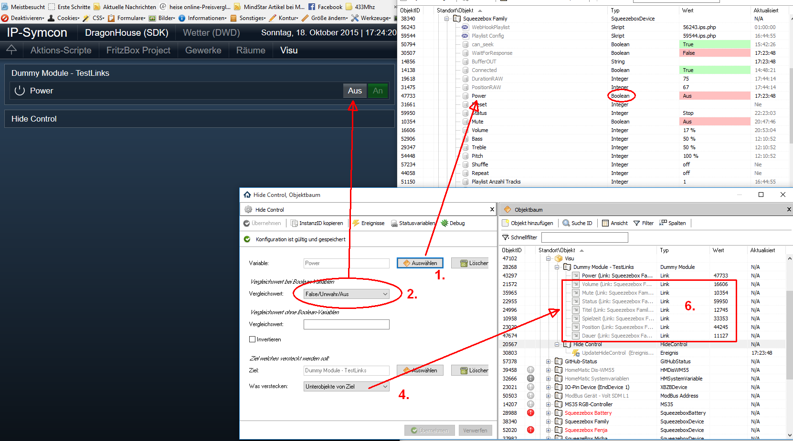
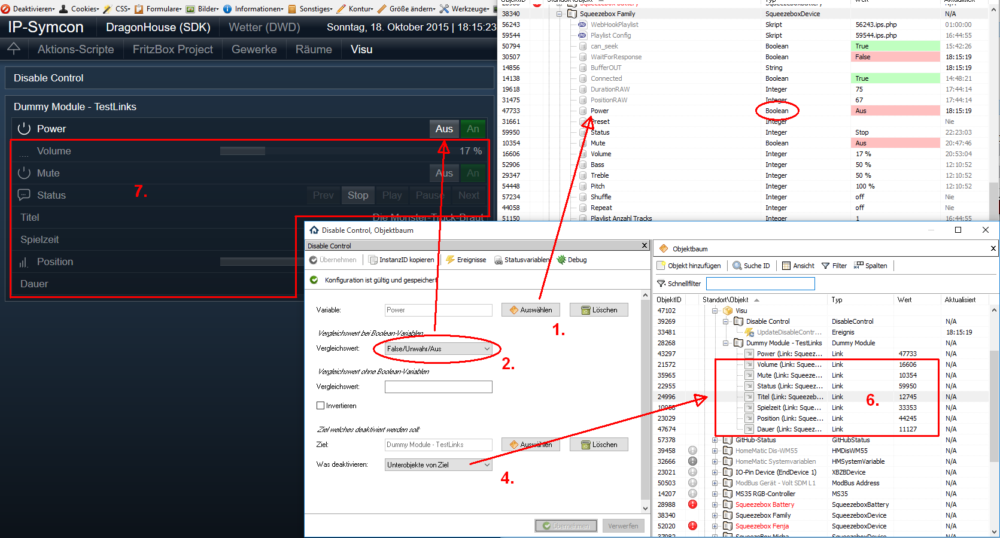

# IPSDynamicVisuControl

Enthält verschiedene Module für die dynamische Visualisierung von Objekten in IP-Symcon.

## Dokumentation

**Inhaltsverzeichnis**

1. [Funktionsumfang](#1-funktionsumfang) 
2. [Voraussetzungen](#2-voraussetzungen)
3. [Installation](#3-installation)
4. [Funktionsreferenz](#4-funktionsreferenz) 
5. [Anhang](#5-anhang)

## 1. Funktionsumfang

### Vorbemerkungen:
 Die Visualisierung im WebFront von IPS sollte nicht direkt mit den Original-Hardware-Instanzen erfolgen.  
 Es empfiehlt sich eine eigene Struktur aus Kategorien, Instanzen des Typ Dummy-Modul und Links zu erzeugen.  
 Da die Eigenschaften 'Sichtbarkeit' und 'Bedienbarkeit' von Links nicht von ihrem Ziel vererbt werden, ist es nicht sinnvoll direkt Hardware-Instanzen zu verstecken oder zu deaktivieren.  

### HideControl
 Versteckt/visualisiert ein vorhandenes Objekt oder dessen direkten Unterobjekte in Abhängigkeit einer Variable.  
 Dazu wird die Variable (1) mit den jeweiligen Wert aus (2) oder (5) verglichen.  
 Ist der Vergleich erfolgreich (= wahr) so wird das Ziel-Objekt (3) versteckt.  
 Optional kann der Parameter Invertieren genutzt werden um den Verleich umzudrehen.  
 
  

 1. Die Variable welche zum Vergleich herangezogen wird.
 2. Sollte es sich bei 1 um eine Variable vom Typ ´boolean´ handeln, so ist hier der Vergleichswert einzutragen.
 3. Das Ziel welches versteckt werden soll.
 4. Hier kann festgelegt werden, ob nur das Ziel (3), oder dessen Unterobjekte deaktiviert werden sollen.
 5. Ist die Variable unter 1 nicht vom Typ ´boolean´ so ist hier der Vergleichswert einzutragen.  
  
**Achtung:**  
  Befindet sich die Variable (1) auch unterhalb dem zu versteckenden Objekt, so ist diese im WebFront dann auch nicht mehr sichtbar.  
  Dies kann gewollt, aber auch hinderlich sein.
  Darum kann alternativ unter 4 festgelegt werden, das nur Unterobjekte versteckt werden.  
  Bei dieser Einstellung wird beim verstecken geprüft, ob unter den Unterobjekten auch die Variable (oder ein Link zur Variable) enthalten ist.
  Dieses Objekt wird dann **nicht** versteckt.

  

 6. Zeigt alle, beim Zustand aus, versteckten Unterobjekte.  
     Es ist auch zu sehen, dass das erste Objekt nicht versteckt wurde, da es sich um einen Link zur Variable 1 handelt.

 
### DisableControl
 Deaktiviert/aktiviert ein vorhandenes Objekt oder dessen direkten Unterobjekte in Abhängigkeit einer Variable.  
 Dazu wird die Variable (1) mit den jeweiligen Wert aus (2) oder (5) verglichen.  
 Ist der Vergleich erfolgreich (= wahr) so wird das Ziel-Objekt (3) deaktiviert.  
 Optional kann der Parameter Invertieren genutzt werden um den Verleich umzudrehen.  
 
 1. Die Variable welche zum Vergleich herangezogen wird.
 2. Sollte es sich bei 1 um eine Variable vom Typ ´boolean´ handeln, so ist hier der Vergleichswert einzutragen.
 3. Das Ziel welches deaktiviert werden soll.
 4. Hier kann festgelegt werden, ob nur das Ziel (3), oder dessen Unterobjekte deaktiviert werden sollen.
 5. Ist die Variable unter 1 nicht vom Typ ´boolean´ so ist hier der Vergleichswert einzutragen.  

**Achtung:**  
  Befindet sich die Variable (1) auch unterhalb dem zu deaktivierenden Objekt, so ist diese im WebFront dann auch nicht mehr bedienbar.  
  Dies kann gewollt, aber auch hinderlich sein.
  Darum kann alternativ unter 4 festgelegt werden, das nur Unterobjekte deaktiviert werden.  
  Bei dieser Einstellung wird beim deaktivieren geprüft, ob unter den Unterobjekten auch die Variable (oder ein Link zur Variable) enthalten ist.
  Dieses Objekt wird dann **nicht** deaktiviert.

  

 6. Zeigt alle, beim Zustand aus, deaktivierten Unterobjekte im Objektbaum.  
 7. Darstellung der deaktivierten Unterobjekte im WebFront.  
     Es ist auch zu sehen, dass das erste Objekt nicht deaktiviert wurde, da es sich um einen Link zur Variable 1 handelt.

### LinkHideControl
 Erzeugt Links zu Unterobjekte eines ausgewählten Objektes und versteckt/visualisiert diese Links in Abhängigkeit einer Variable.  

### LinkDisableControl
 Erzeugt Links zu Unterobjekte eines ausgewählten Objektes und deaktiviert/aktiviert diese Links in Abhängigkeit einer Variable.  

### LinkGroupHideControl
 Versteckt/visualisiert untergeordnete Links, in Abhänigkeit der Werte der jeweiligen Zielvariable.  

**TODO** 

## 2. Voraussetzungen

 - IPS 4.x
 
## 3. Installation

   - IPS 4.x  
        Über das 'Modul Control' folgende URL hinzufügen:  
        `git://github.com/Nall-chan/IPSDynamicVisuControl.git`  

## 4. Funktionsreferenz

keine  Funktionen verfügbar.

## 5. Anhang

**GUID's:**  
 folgen

**Einstellungen:**
  folgen

**Changelog:**  
 Version 1.0:
  - Erstes Release
