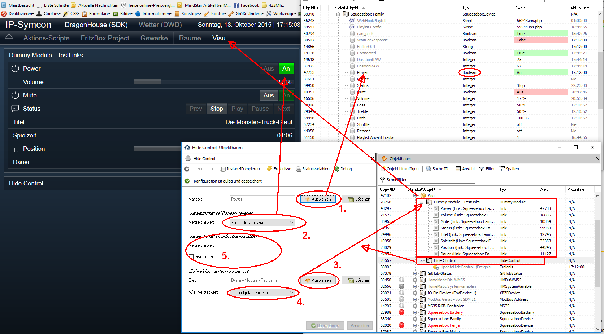
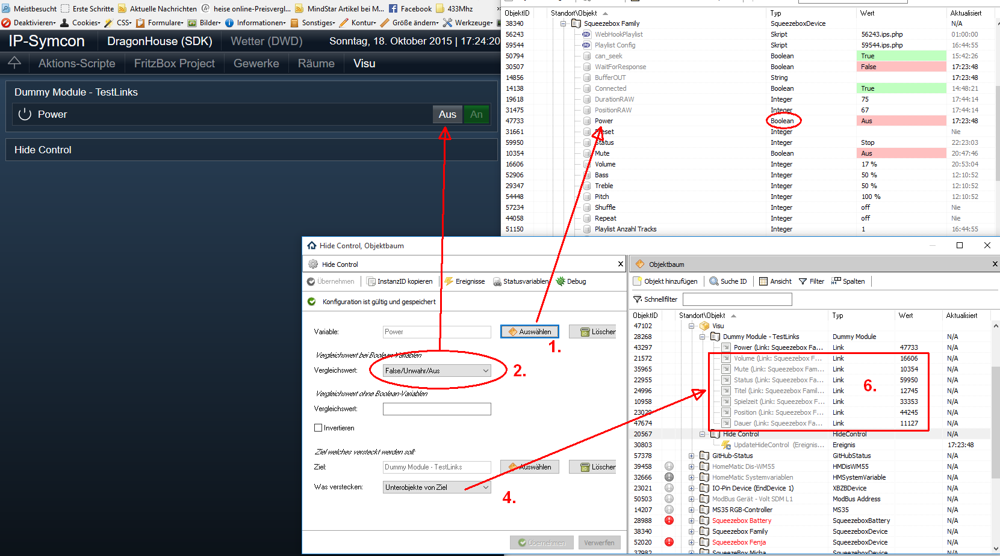
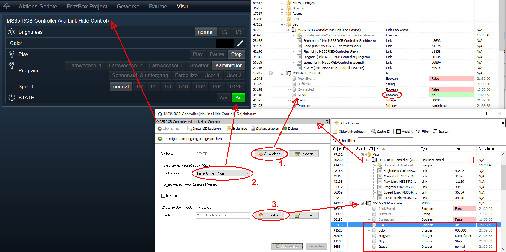
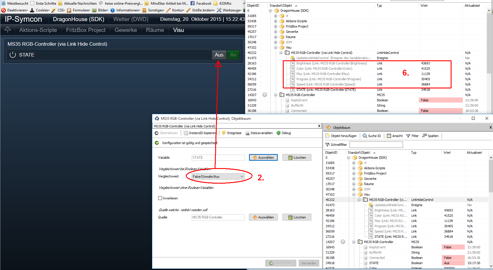
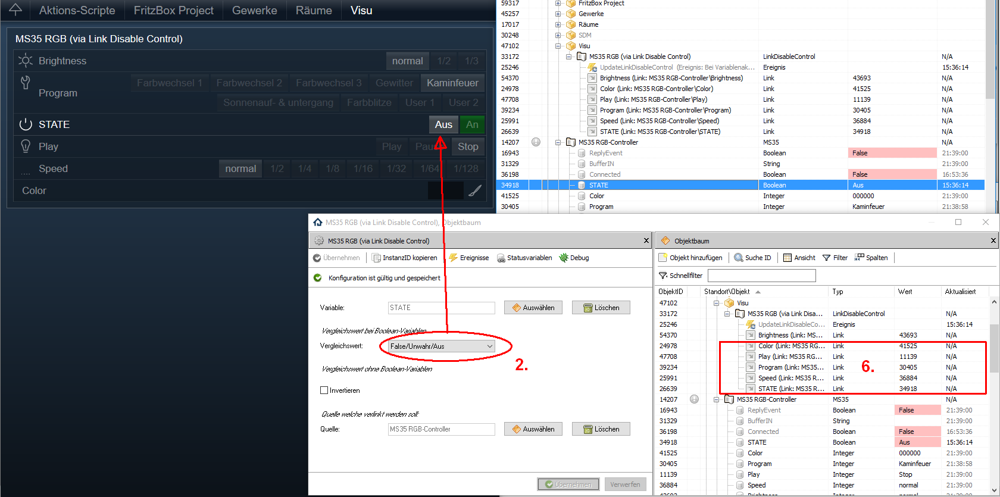

  

# IPSDynamicVisuControl Library

Enthält verschiedene Module für die dynamische Visualisierung von Objekten in IP-Symcon.

## Dokumentation

**Inhaltsverzeichnis**

1. [Funktionsumfang](#1-funktionsumfang) 
2. [Voraussetzungen](#2-voraussetzungen)
3. [Installation](#3-installation)
4. [PHP-Befehlsreferenz](#4-php-befehlsreferenz) 
5. [Parameter / Modul-Infos](#5-parameter--modul-infos)
6. [Anhang](#6-anhang)
7. [Lizenz](#7-lizenz)

## 1. Funktionsumfang

### Vorbemerkungen:
 Die Visualisierung im WebFront von IPS sollte nicht direkt mit den Original-Hardware-Instanzen erfolgen.  
 Es empfiehlt sich eine eigene Struktur aus Kategorien, Instanzen des Typ Dummy-Modul und Links zu erzeugen.  
 Da die Eigenschaften 'Sichtbarkeit' und 'Bedienbarkeit' von Links nicht von ihrem Ziel vererbt werden, ist es nicht sinnvoll direkt Hardware-Instanzen zu verstecken oder zu deaktivieren.  

### HideControl
 Versteckt/visualisiert ein vorhandenes Objekt oder dessen direkten Unterobjekte in Abhängigkeit einer Variable.  
 Dazu wird die Variable (1) mit den jeweiligen Wert aus (2) oder (5) verglichen.  
 Ist der Vergleich erfolgreich (= wahr) so wird das Ziel-Objekt (3) versteckt.  
 Optional kann der Parameter Invertieren genutzt werden um den Verleich umzudrehen.  
 
  
  

 1. Die Variable welche zum Vergleich herangezogen wird.  
 2. Sollte es sich bei 1 um eine Variable vom Typ ´boolean´ handeln, so ist hier der Vergleichswert einzutragen.  
 3. Das Ziel welches versteckt werden soll.  
 4. Hier kann festgelegt werden, ob nur das Ziel (3), oder dessen Unterobjekte versteckt werden sollen.  
 5. Ist die Variable unter 1 nicht vom Typ ´boolean´ so ist hier der Vergleichswert einzutragen.  
 6. Zeigt alle, beim Zustand aus, versteckten Unterobjekte.  
     Es ist auch zu sehen, dass das erste Objekt nicht versteckt wurde, da es sich um einen Link zur Variable 1 handelt.  
  
**Achtung:**  
  Befindet sich die Variable (1) auch unterhalb dem zu versteckenden Objekt, so ist diese im WebFront dann auch nicht mehr sichtbar.  
  Dies kann gewollt, aber auch hinderlich sein.  
  Darum kann alternativ unter 4 festgelegt werden, das nur Unterobjekte versteckt werden.  
  Bei dieser Einstellung wird beim verstecken geprüft, ob unter den Unterobjekten auch die Variable (oder ein Link zur Variable) enthalten ist.  
  Dieses Objekt wird dann **nicht** versteckt.  

 
### DisableControl
 Deaktiviert/aktiviert ein vorhandenes Objekt oder dessen direkten Unterobjekte in Abhängigkeit einer Variable.  
 Dazu wird die Variable (1) mit den jeweiligen Wert aus (2) oder (5) verglichen.  
 Ist der Vergleich erfolgreich (= wahr) so wird das Ziel-Objekt (3) deaktiviert.  
 Optional kann der Parameter Invertieren genutzt werden um den Verleich umzudrehen.  
 
  

 1. Die Variable welche zum Vergleich herangezogen wird.  
 2. Sollte es sich bei 1 um eine Variable vom Typ ´boolean´ handeln, so ist hier der Vergleichswert einzutragen.  
 3. Das Ziel welches deaktiviert werden soll.  
 4. Hier kann festgelegt werden, ob nur das Ziel (3), oder dessen Unterobjekte deaktiviert werden sollen.  
 5. Ist die Variable unter 1 nicht vom Typ ´boolean´ so ist hier der Vergleichswert einzutragen.  
 6. Zeigt alle, beim Zustand aus, deaktivierten Unterobjekte im Objektbaum.  
 7. Darstellung der deaktivierten Unterobjekte im WebFront.  
     Es ist auch zu sehen, dass das erste Objekt nicht deaktiviert wurde, da es sich um einen Link zur Variable 1 handelt.  

**Achtung:**  
  Befindet sich die Variable (1) auch unterhalb dem zu deaktivierenden Objekt, so ist diese im WebFront dann auch nicht mehr bedienbar.  
  Dies kann gewollt, aber auch hinderlich sein.  
  Darum kann alternativ unter 4 festgelegt werden, das nur Unterobjekte deaktiviert werden.  
  Bei dieser Einstellung wird beim deaktivieren geprüft, ob unter den Unterobjekten auch die Variable (oder ein Link zur Variable) enthalten ist.  
  Dieses Objekt wird dann **nicht** deaktiviert.  

### LinkHideControl
 Erzeugt Links zu Unterobjekte eines ausgewählten Objektes und versteckt/visualisiert diese Links in Abhängigkeit einer Variable.  
 Die Links werden aus allen direkten Unterobjekten des Quell-Objektes (3) automatisch erzeugt.  
 Dabei werden versteckte Objekte im Quell-Objekt (3) ignoriert.  
 Zum Vergleich wird wieder die Variable (1) mit den jeweiligen Wert aus (2) oder (5) verglichen.  
 Ist der Vergleich erfolgreich (= wahr) so werden die vorher erzeugten Links versteckt.  
 Optional kann der Parameter Invertieren genutzt werden um den Verleich umzudrehen.  

  
  

 1. Die Variable welche zum Vergleich herangezogen wird.  
 2. Sollte es sich bei 1 um eine Variable vom Typ ´boolean´ handeln, so ist hier der Vergleichswert einzutragen.  
 3. Das Quell-Objekt von dessen Unterobjekte Links erzeugt werden sollen.  
 4. -entfällt-  
 5. Ist die Variable unter 1 nicht vom Typ ´boolean´ so ist hier der Vergleichswert einzutragen.  
 6. Zeigt die autoamtisch erstellen Links.  
  
**Achtung:**  
  Diese Instanz ist für die direkte Visualisierung gedacht.  

### LinkDisableControl
 Erzeugt Links zu Unterobjekte eines ausgewählten Objektes und deaktiviert/aktiviert diese Links in Abhängigkeit einer Variable.  
 Die Links werden aus allen direkten Unterobjekten des Quell-Objektes (3) automatisch erzeugt.  
 Dabei werden versteckte Objekte im Quell-Objekt (3) ignoriert.  
 Zum Vergleich wird wieder die Variable (1) mit den jeweiligen Wert aus (2) oder (5) verglichen.  
 Ist der Vergleich erfolgreich (= wahr) so werden die vorher erzeugten Links versteckt.  
 Optional kann der Parameter Invertieren genutzt werden um den Verleich umzudrehen.  

  

 1. Die Variable welche zum Vergleich herangezogen wird.  
 2. Sollte es sich bei 1 um eine Variable vom Typ ´boolean´ handeln, so ist hier der Vergleichswert einzutragen.  
 3. Das Quell-Objekt von dessen Unterobjekte Links erzeugt werden sollen.  
 4. -entfällt-  
 5. Ist die Variable unter 1 nicht vom Typ ´boolean´ so ist hier der Vergleichswert einzutragen.  
 6. Zeigt die autoamtisch erstellen Links.  
  
**Achtung:**  
  Diese Instanz ist für die direkte Visualisierung gedacht.  

## 2. Voraussetzungen

 - IPS 4.3 oder neuer
 
## 3. Installation

**IPS 4.3:**  
   Bei privater Nutzung: Über das 'Module-Control' in IPS folgende URL hinzufügen.  
        `git://github.com/Nall-chan/IPSDynamicVisuControl.git`  

   **Bei kommerzieller Nutzung (z.B. als Errichter oder Integrator) wenden Sie sich bitte an den Autor.**  

## 4. PHP-Befehlsreferenz

keine  Funktionen verfügbar.

## 5. Parameter / Modul-Infos

**GUIDs der Instanzen (z.B. wenn Instanz per PHP angelegt werden soll):**  

| Instanz                       | GUID                                   |
| :---------------------------: | :------------------------------------: |
| HideControl                   | {A9347205-0889-4D01-BDD2-C377FC0E39D9} |
| DisableControl                | {61618A2B-D39D-4F1D-B27E-DEF2CF9452F9} |
| LinkHideControl               | {37BC47EE-E95A-4DAF-A408-129D778F7AB5} |
| LinkDisableControl            | {E94821F4-1647-440B-BB2A-76F8CF1CBB16} |

**Eigenschaften von HideControl:**  

| Eigenschaft      | Typ     | Standardwert | Funktion                                                                  |
| :--------------: | :-----: | :----------: | :-----------------------------------------------------------------------: |
| Source           | integer | 0            | Quell-Variable welche zum Vergleich dient                                 |
| ConditionBoolean | integer | 1            | 1 wenn bei Wert true von Source versteckt werden soll                     |
| ConditionValue   | string  |              | Vergleichswert für Wert von Source zum verstecken                         |
| Invert           | boolean | false        | True wenn der Vergleich noch einmal invertiert werden soll                |
| Target           | integer | 0            | IPS-Objekt-ID des Ziel-Objektes welche versteckt werden soll              |
| TargetType       | integer | 0            | 0 Wenn Target, 1 wenn dessen Unterobjekte versteckt werden sollen         |

**Eigenschaften von DisableControl:**  

| Eigenschaft      | Typ     | Standardwert | Funktion                                                                  |
| :--------------: | :-----: | :----------: | :-----------------------------------------------------------------------: |
| Source           | integer | 0            | Quell-Variable welche zum Vergleich dient                                 |
| ConditionBoolean | integer | 1            | 1 wenn bei Wert true von Source deaktiviert werden soll                   |
| ConditionValue   | string  |              | Vergleichswert für Wert von Source zum deaktivieren                       |
| Invert           | boolean | false        | True wenn der Vergleich noch einmal invertiert werden soll                |
| Target           | integer | 0            | IPS-Objekt-ID des Ziel-Objektes welche deaktiviert werden soll            |
| TargetType       | integer | 0            | 0 Wenn Target, 1 wenn dessen Unterobjekte deaktiviert werden sollen       |

**Eigenschaften von LinkHideControl:**  

| Eigenschaft      | Typ     | Standardwert | Funktion                                                                  |
| :--------------: | :-----: | :----------: | :-----------------------------------------------------------------------: |
| Source           | integer | 0            | Quell-Variable welche zum Vergleich dient                                 |
| ConditionBoolean | integer | 1            | 1 wenn bei Wert true von Source versteckt werden soll                     |
| ConditionValue   | string  |              | Vergleichswert für Wert von Source zum verstecken                         |
| Invert           | boolean | false        | True wenn der Vergleich noch einmal invertiert werden soll                |
| LinkSource       | integer | 0            | IPS-Objekt-ID welches verlinkt werden soll                                |

**Eigenschaften von LinkDisableControl:**  

| Eigenschaft      | Typ     | Standardwert | Funktion                                                                  |
| :--------------: | :-----: | :----------: | :-----------------------------------------------------------------------: |
| Source           | integer | 0            | Quell-Variable welche zum Vergleich dient                                 |
| ConditionBoolean | integer | 1            | 1 wenn bei Wert true von Source deaktiviert werden soll                   |
| ConditionValue   | string  |              | Vergleichswert für Wert von Source zum deaktivieren                       |
| Invert           | boolean | false        | True wenn der Vergleich noch einmal invertiert werden soll                |
| LinkSource       | integer | 0            | IPS-Objekt-ID welches verlinkt werden soll                                |

## 6. Anhang

Die Library ist für die nicht kommzerielle Nutzung kostenlos, Schenkungen als Unterstützung für den Autor werden hier akzeptiert:  

**Changlog:**  

 Version 2.01:
    - Release für IPS 4.3  

 Version 2.0:  
    - Release für IPS 4.1  

 Version 1.0:  
    - Release für IPS 4.0  

## 7. Lizenz  

[CC BY-NC-SA 4.0](https://creativecommons.org/licenses/by-nc-sa/4.0/)  
