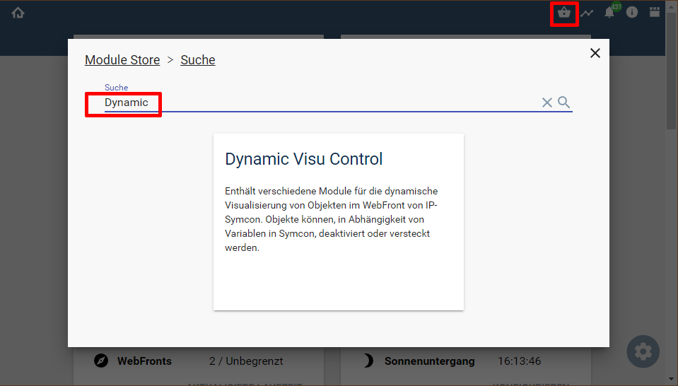
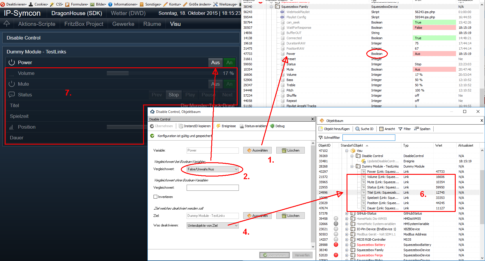
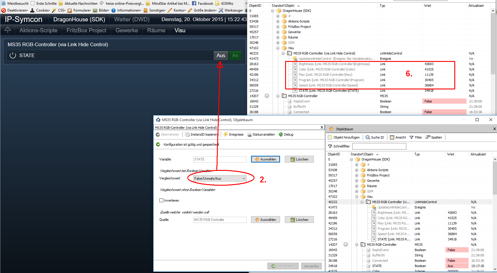
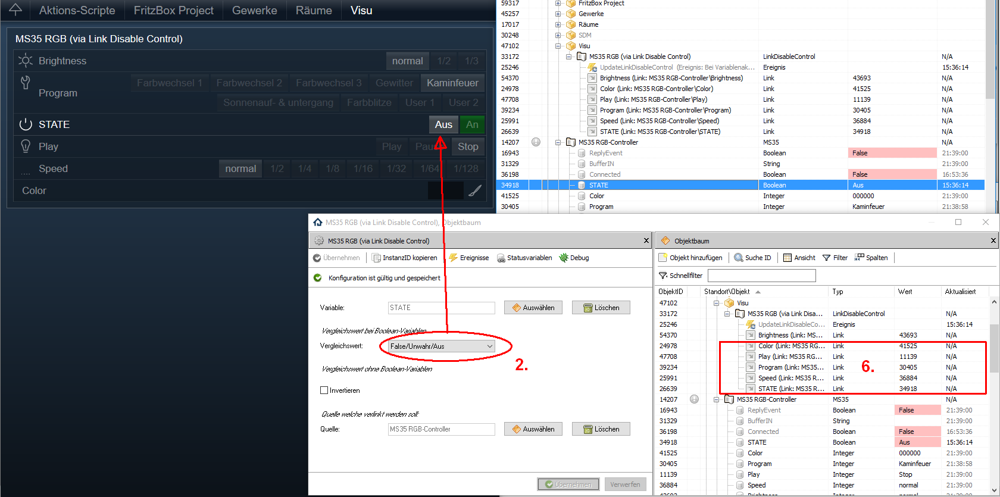

  

   

  
# Dynamic Visu Control <!-- omit in toc -->
Enthält verschiedene Module für die dynamische Visualisierung von Objekten im WebFront von IP-Symcon.

## Dokumentation <!-- omit in toc -->

**Inhaltsverzeichnis**

- [1. Vorbemerkungen](#1-vorbemerkungen)
- [2. Voraussetzungen](#2-voraussetzungen)
- [3. Software-Installation](#3-software-installation)
- [4. Enthaltene Module](#4-enthaltene-module)
  - [HideControl](#hidecontrol)
  - [DisableControl](#disablecontrol)
  - [LinkHideControl](#linkhidecontrol)
  - [LinkDisableControl](#linkdisablecontrol)
- [5. Anhang](#5-anhang)
  - [1. GUID der Module](#1-guid-der-module)
  - [2. Eigenschaften der Instanzen](#2-eigenschaften-der-instanzen)
  - [3. Changelog](#3-changelog)
  - [4. Spenden](#4-spenden)
- [6. Lizenz](#6-lizenz)

## 1. Vorbemerkungen
 **Die Visualisierung im WebFront von IPS sollte nicht direkt mit den Original-Hardware-Instanzen erfolgen.  
 Es empfiehlt sich eine eigene Struktur aus Kategorien, Instanzen des Typ Dummy-Modul und Links zu erzeugen.  
 Da die Eigenschaften 'Sichtbarkeit' und 'Bedienbarkeit' von Links nicht von ihrem Ziel vererbt werden, ist es nicht sinnvoll direkt Hardware-Instanzen zu verstecken oder zu deaktivieren.**  
 
## 2. Voraussetzungen

* IP-Symcon ab Version 8.1

## 3. Software-Installation
  
  Über den 'Module-Store' in IPS das Modul 'Dynamic Visu Control' hinzufügen.  
   **Bei kommerzieller Nutzung (z.B. als Errichter oder Integrator) wenden Sie sich bitte an den Autor.**  
 

## 4. Enthaltene Module

### HideControl
 Versteckt/visualisiert ein vorhandenes Objekt oder dessen direkten Unterobjekte in Abhängigkeit einer Variable.  
 Dazu wird die Variable __(1)__ mit den jeweiligen Wert aus __(2)__ oder __(5)__ verglichen.  
 Ist der Vergleich erfolgreich (= wahr) so wird das Ziel-Objekt __(3)__ versteckt.  
 Optional kann der Parameter Invertieren genutzt werden um den Vergleich umzudrehen.  
 
  
  

 __1.__ Die Variable welche zum Vergleich herangezogen wird.  
 __2.__ Sollte es sich bei __(1)__ um eine Variable vom Typ `boolean` handeln, so ist hier der Vergleichswert einzutragen.  
 __3.__ Das Ziel welches versteckt werden soll.  
 __4__ Hier kann festgelegt werden, ob nur das Ziel __(3)__, oder dessen Unterobjekte versteckt werden sollen.  
 __5.__ Ist die Variable unter __(1)__ nicht vom Typ `boolean` so ist hier der Vergleichswert einzutragen.  
 __6.__ Zeigt alle, beim Zustand aus, versteckten Unterobjekte.  
     Es ist auch zu sehen, dass das erste Objekt nicht versteckt wurde, da es sich um einen Link zur Variable __(1)__ handelt.  
  
**Achtung:**  
  Befindet sich die Variable __(1)__ auch unterhalb dem zu versteckenden Objekt, so ist diese im WebFront dann auch nicht mehr sichtbar.  
  Dies kann gewollt, aber auch hinderlich sein.  
  Darum kann alternativ unter __(4)__ festgelegt werden, das nur Unterobjekte versteckt werden.  
  Bei dieser Einstellung wird beim verstecken geprüft, ob unter den Unterobjekten auch die Variable (oder ein Link zur Variable) enthalten ist.  
  Dieses Objekt wird dann **nicht** versteckt.  
  
---  
  
### DisableControl
 Deaktiviert/aktiviert ein vorhandenes Objekt oder dessen direkten Unterobjekte in Abhängigkeit einer Variable.  
 Dazu wird die Variable __(1)__ mit den jeweiligen Wert aus __(2)__ oder __(5)__ verglichen.  
 Ist der Vergleich erfolgreich (= wahr) so wird das Ziel-Objekt __(3)__ deaktiviert.  
 Optional kann der Parameter Invertieren genutzt werden um den Vergleich umzudrehen.  
 
  

 __1.__ Die Variable welche zum Vergleich herangezogen wird.  
 __2.__ Sollte es sich bei __(1)__ um eine Variable vom Typ `boolean` handeln, so ist hier der Vergleichswert einzutragen.  
 __3.__ Das Ziel welches deaktiviert werden soll.  
 __4.__ Hier kann festgelegt werden, ob nur das Ziel __(3)__, oder dessen Unterobjekte deaktiviert werden sollen.  
 __5.__ Ist die Variable unter __(1)__ nicht vom Typ `boolean` so ist hier der Vergleichswert einzutragen.  
 __6.__ Zeigt alle, beim Zustand aus, deaktivierten Unterobjekte im Objektbaum.  
 __7.__ Darstellung der deaktivierten Unterobjekte im WebFront.  
     Es ist auch zu sehen, dass das erste Objekt nicht deaktiviert wurde, da es sich um einen Link zur Variable __(1)__ handelt.  

**Achtung:**  
  Befindet sich die Variable __(1)__ auch unterhalb dem zu deaktivierenden Objekt, so ist diese im WebFront dann auch nicht mehr bedienbar.  
  Dies kann gewollt, aber auch hinderlich sein.  
  Darum kann alternativ unter __(4)__ festgelegt werden, das nur Unterobjekte deaktiviert werden.  
  Bei dieser Einstellung wird beim deaktivieren geprüft, ob unter den Unterobjekten auch die Variable (oder ein Link zur Variable) enthalten ist.  
  Dieses Objekt wird dann **nicht** deaktiviert.  

---

### LinkHideControl
 Erzeugt Links zu Unterobjekte eines ausgewählten Objektes und versteckt/visualisiert diese Links in Abhängigkeit einer Variable.  
 Die Links werden aus allen direkten Unterobjekten des Quell-Objektes __(3)__ automatisch erzeugt.  
 Dabei werden versteckte Objekte im Quell-Objekt __(3)__ ignoriert.  
 Zum Vergleich wird wieder die Variable __(1)__ mit den jeweiligen Wert aus __(2)__ oder __(5)__ verglichen.  
 Ist der Vergleich erfolgreich (= wahr) so werden die vorher erzeugten Links versteckt.  
 Optional kann der Parameter Invertieren genutzt werden um den Vergleich umzudrehen.  

  
  

 __1.__ Die Variable welche zum Vergleich herangezogen wird.  
 __2.__ Sollte es sich bei __(1)__ um eine Variable vom Typ `boolean` handeln, so ist hier der Vergleichswert einzutragen.  
 __3.__ Das Quell-Objekt von dessen Unterobjekte Links erzeugt werden sollen.  
 __4.__  -entfällt-  
 __5.__ Ist die Variable unter __(1)__ nicht vom Typ `boolean` so ist hier der Vergleichswert einzutragen.  
 __6.__ Zeigt die automatisch erstellen Links.  
  
**Achtung:**  
  Diese Instanz ist für die direkte Visualisierung gedacht.  

---

### LinkDisableControl
 Erzeugt Links zu Unterobjekte eines ausgewählten Objektes und deaktiviert/aktiviert diese Links in Abhängigkeit einer Variable.  
 Die Links werden aus allen direkten Unterobjekten des Quell-Objektes __(3)__ automatisch erzeugt.  
 Dabei werden versteckte Objekte im Quell-Objekt __(3)__ ignoriert.  
 Zum Vergleich wird wieder die Variable __(1)__ mit den jeweiligen Wert aus __(2)__ oder __(5)__ verglichen.  
 Ist der Vergleich erfolgreich (= wahr) so werden die vorher erzeugten Links versteckt.  
 Optional kann der Parameter Invertieren genutzt werden um den Vergleich umzudrehen.  
 
  

 __1.__ Die Variable welche zum Vergleich herangezogen wird.  
 __2.__ Sollte es sich bei __(1)__ um eine Variable vom Typ `boolean` handeln, so ist hier der Vergleichswert einzutragen.  
 __3.__ Das Quell-Objekt von dessen Unterobjekte Links erzeugt werden sollen.  
 __4.__ -entfällt-  
 __5.__ Ist die Variable unter __(1)__ nicht vom Typ `boolean` so ist hier der Vergleichswert einzutragen.  
 __6.__ Zeigt die automatisch erstellen Links.  
  
**Achtung:**  
  Diese Instanz ist für die direkte Visualisierung gedacht.  

## 5. Anhang

###  1. GUID der Module

|      Instanz       |                  GUID                  |
| :----------------: | :------------------------------------: |
|    HideControl     | {A9347205-0889-4D01-BDD2-C377FC0E39D9} |
|   DisableControl   | {61618A2B-D39D-4F1D-B27E-DEF2CF9452F9} |
|  LinkHideControl   | {37BC47EE-E95A-4DAF-A408-129D778F7AB5} |
| LinkDisableControl | {E94821F4-1647-440B-BB2A-76F8CF1CBB16} |

###  2. Eigenschaften der Instanzen

**Eigenschaften von HideControl:**  

| Eigenschaft |   Typ   | Standardwert |                             Funktion                              |
| :---------: | :-----: | :----------: | :---------------------------------------------------------------: |
|   Source    | integer |      1       |             Quell-Variable welche zum Vergleich dient             |
|    Value    | string  |      []      |               Vergleichswert für Wert, JSON kodiert               |
|   Invert    | boolean |    false     |    True wenn der Vergleich noch einmal invertiert werden soll     |
|   Target    | integer |      1       |   IPS-Objekt-ID des Ziel-Objektes welche versteckt werden soll    |
| TargetType  | integer |      0       | 0 Wenn Target, 1 wenn dessen Unterobjekte versteckt werden sollen |

**Eigenschaften von DisableControl:**  

| Eigenschaft |   Typ   | Standardwert |                              Funktion                               |
| :---------: | :-----: | :----------: | :-----------------------------------------------------------------: |
|   Source    | integer |      1       |              Quell-Variable welche zum Vergleich dient              |
|    Value    | string  |      []      |                Vergleichswert für Wert, JSON kodiert                |
|   Invert    | boolean |    false     |     True wenn der Vergleich noch einmal invertiert werden soll      |
|   Target    | integer |      1       |   IPS-Objekt-ID des Ziel-Objektes welche deaktiviert werden soll    |
| TargetType  | integer |      0       | 0 Wenn Target, 1 wenn dessen Unterobjekte deaktiviert werden sollen |

**Eigenschaften von LinkHideControl:**  

| Eigenschaft |   Typ   | Standardwert |                          Funktion                          |
| :---------: | :-----: | :----------: | :--------------------------------------------------------: |
|   Source    | integer |      1       |         Quell-Variable welche zum Vergleich dient          |
|    Value    | string  |      []      |           Vergleichswert für Wert, JSON kodiert            |
|   Invert    | boolean |    false     | True wenn der Vergleich noch einmal invertiert werden soll |
| LinkSource  | integer |      1       |         IPS-Objekt-ID welches verlinkt werden soll         |

**Eigenschaften von LinkDisableControl:**  

| Eigenschaft |   Typ   | Standardwert |                          Funktion                          |
| :---------: | :-----: | :----------: | :--------------------------------------------------------: |
|   Source    | integer |      1       |         Quell-Variable welche zum Vergleich dient          |
|    Value    | string  |      []      |           Vergleichswert für Wert, JSON kodiert            |
|   Invert    | boolean |    false     | True wenn der Vergleich noch einmal invertiert werden soll |
| LinkSource  | integer |      1       |         IPS-Objekt-ID welches verlinkt werden soll         |

### 3. Changelog

**Version 3.70:**  
 - Release für Symcon 8.1  
 - Dynamisches Konfigurationsformular bietet Vergleichswerte mit Profil an
 
**Version 3.50:**  
- Release für IPS 6.3  
- Dynamisches Konfigurationsformular welches Vergleichswerte auf Basis der Quelle anbietet  

**Version 3.10:**  
- Release für IPS 6.1  
- Dynamisches Konfigurationsformular welche die nicht benötigten Vergleichswerte ausblendet  
   
**Version 3.00:**  
- Release für IPS 5.1 und den Module-Store  
- IPS_SetProperty und IPS_Applychanges auf sich selbst entfernt   

**Version 2.02:**  
- Fixes für IPS 5.0

**Version 2.01:**
- Release für IPS 4.3  

**Version 2.0:**  
- Release für IPS 4.1  

**Version 1.0:**  
- Release für IPS 4.0  

### 4. Spenden

  Die Library ist für die nicht kommerzielle Nutzung kostenlos, Schenkungen als Unterstützung für den Autor werden hier akzeptiert:  

  PayPal:  
  

  Wunschliste:  
  

## 6. Lizenz  

[CC BY-NC-SA 4.0](https://creativecommons.org/licenses/by-nc-sa/4.0/)  
